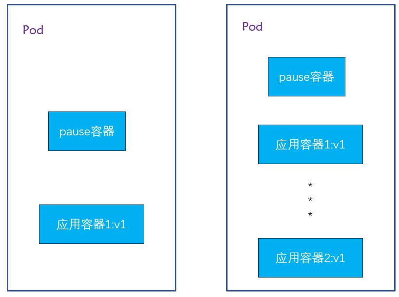
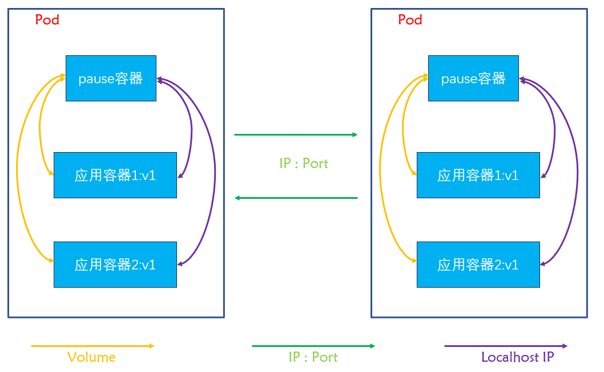
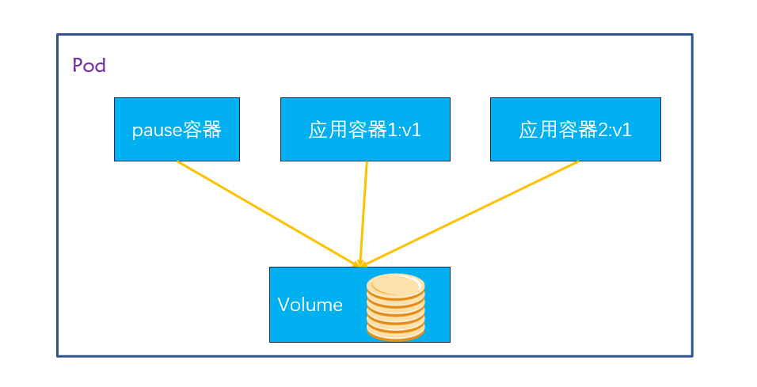
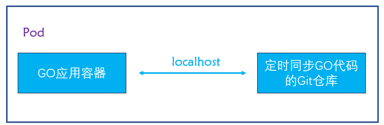
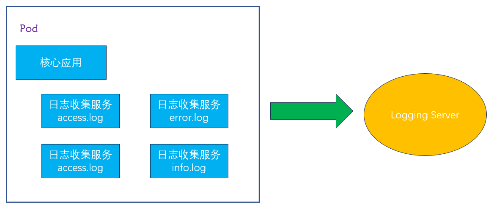
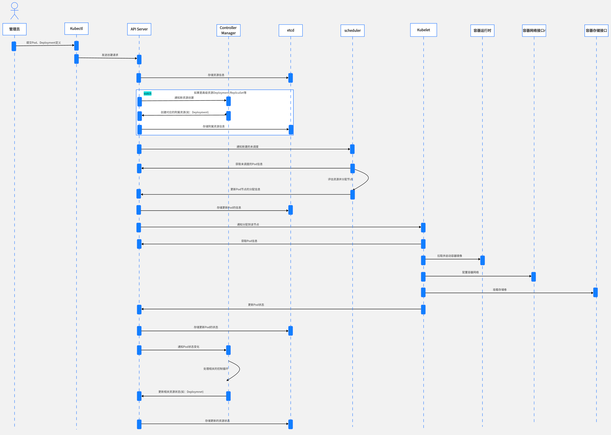

[TOC]


# 1. Pod

## 1.1 Pod 是什么？

[Pod 介绍-腾讯云开发者社区-腾讯云](https://cloud.tencent.com/developer/article/2108791)



```shell
[root@k8s-master ~]# kubectl get pods
NAME                            READY   STATUS    RESTARTS        AGE
zy-pod-nginx-7d4fddb458-5mxdc   1/1     Running   4 (2m22s ago)   3d4h
zy-pod-nginx-7d4fddb458-tdx9q   1/1     Running   4 (2m22s ago)   3d4h
zy-pod-nginx-7d4fddb458-wwq2w   1/1     Running   8 (2m22s ago)   8d
[root@k8s-master ~]# 
```

Pod是K8S中创建、管理、调度的最小计算单元。

Pod包含一个或多个应用容器，这些容器相对紧密地耦合在一起，并且共享网络、存储、以及怎样运行的规约。

Pod中的内容总是并置(colocated)的，并且一同调度，在共享的上下文中运行。

Pod在启动期间可以运行Init Containers和临时性容器来调试正在运行的Pod。

Pod 的共享上下文包括一组 Linux 名字空间、控制组（CGroup）、联合文件系统（UnionFS）和可能一些其他的隔离方面， 即用来隔离[容器](https://kubernetes.io/zh-cn/docs/concepts/containers/)的技术。 在 Pod 的上下文中，每个独立的应用可能会进一步实施隔离。


```shell
在 Kubernetes 里，pause 容器是 kubelet 为每个 Pod 隐式创建的一个“infra 容器”，用来为 Pod 内的所有业务容器共享网络和 IPC 命名空间。它本身没有业务逻辑，所以日常几乎不会直接和它交互，但调试或排障时有时需要确认它的存在。
```

**我们可以看到，当我们启动一个 Pod 以后，每个 Pod 内都会有一个 Pause 的容器**

每个 Pod 里运行着一个特殊的被称之为 Pause 的容器，其他容器则为业务容器，这些业务容器共享 Pause 容器的网络栈和 Volume 挂载卷，因此他们之间通信和数据交换更为高效，在设计时我们可以充分利用这一特性将一组密切相关的服务进程放入同一个 Pod 中。同一个 Pod 里的容器之间仅需通过 localhost 就能互相通信。


## 1.2 Pod网络

Pod是有IP地址的，假如pod不是共享物理机ip，由网络插件（calico、flannel、weave）划分的ip，每个pod都被分配唯一的IP地址。

在k8s中，启动Pod时，会先启动⼀个pause 的容器，然后将后续的所有容器都 "link 到这个pause 的容器，以实现⽹络共享。

- 每个Pod被分配了唯一的IP地址，该Pod内的所有容器共享一个网络空间，包括IP和端口。 
-  同个Pod不同容器之间通过localhost通信，Pod内端口不能冲突。 
-  不同Pod之间的通信则通过IP+端口的形式来访问到Pod内的具体服务（容器）。




## 1.3 Pod存储

创建Pod的时候可以指定挂载的存储卷。 POD中的所有容器都可以访问共享卷，允许这些容器共享数据。 Pod只要挂载持久化数据卷，Pod重启之后数据还是会存在的。




## 1.4 有了容器，为什么还需要Pod？

Pod中的所用容器会被一致调度、同节点部署，并且在一个“共享环境”中运行。

有些容器需要紧密联系，需要一起工作。Pod提供了比容器更高层次的抽象， Pod中的所有容器使用同一个网络的namespace，即相同的IP地址和Port空间。它们可以直接用localhost通信。同样的，这些容器可以共享存储，当K8s挂载Volume到Pod上，本质上是将volume挂载到Pod中的每一个容器里。


### 1.4.1 代码自动发版更新

假如生产环境部署了一个go的应用，而且部署了几百个节点，希望这个应用可以定时的同步最新的代码，以便自动升级线上环境。这时，我们不希望改动原来的go应用，可以开发一个Git代码仓库的自动同步服务，然后通过Pod的方式进行编排，并共享代码目录，就可以达到更新go应用代码的效果。




### 1.4.2 收集日志服务

某服务模块已经实现了一些核心的业务逻辑，并且稳定运行了一段时间，日志记录在了某个目录下，按照不同级别分别为 error.log、access.log、warning.log、info.log，现在希望收集这些日志并发送到统一的日志处理服务器上。

这时我们可以修改原来的服务模块，在其中添加日志收集、发送的服务，但这样可能会影响原来服务的配置、部署方式，从而带来不必要的问题和成本，也会增加业务逻辑和基础服务的藕合度。

如果使用Pod的方式，通过简单的编排，既可以保持原有服务逻辑、部署方式不变，又可以增加新的日志收集服务。

而且如果我们对所有服务的日志生成有一个统一的标准，或者仅对日志收集服务稍加修改，就可以将日志收集服务和其他服务进行Pod编排，提供统一、标准的日志收集方式。

这里的“核心业务服务”、“日志收集服务”分别是一个镜像，运行在隔离的容器环境中。




# 2. Pod工作方式

在K8s中，所有的资源都可以使用一个yaml文件来创建，创建Pod也可以使用yaml配置文件。或者使用kubectl run在命令行创建Pod（不常用）。

## 2.1 自主式Pod

```shell
[root@k8s-node01 ~]# ctr -n=k8s.io images import nginx-zy.tar 
[root@k8s-node02 ~]# ctr -n=k8s.io images import nginx-zy.tar 

[root@k8s-node01 ~]# crictl images | grep -i nginx-zy
docker.io/library/nginx-zy                                                                             latest                                    7af09a0a62276       1.39GB
[root@k8s-node01 ~]# 

[root@k8s-node02 ~]# crictl images | grep -i nginx-zy
docker.io/library/nginx-zy                                                                             latest                                    7af09a0a62276       1.39GB
[root@k8s-node02 ~]# 
```


```yaml
apiVersion: v1
kind: Pod
metadata:
  namespace: default
  name: pod-zy-nginx
  labels:
    app: pod-zy-nginx
spec:
  containers:
  - name: zy-nginx
    image: nginx-zy:latest
    imagePullPolicy: IfNotPresent
    ports:
    - containerPort: 80
```


```shell
[root@k8s-master Pod]# kubectl apply -f pod-nginx-zy.yaml 
pod/pod-zy-nginx created
[root@k8s-master Pod]# kubectl get pods -o wide -n default
NAME           READY   STATUS    RESTARTS   AGE   IP              NODE         NOMINATED NODE   READINESS GATES
pod-zy-nginx   1/1     Running   0          68s   10.244.58.249   k8s-node02   <none>           <none>
[root@k8s-master Pod]# kubectl describe pods pod-zy-nginx -n default
******
Events:
  Type    Reason     Age   From               Message
  ----    ------     ----  ----               -------
  Normal  Scheduled  98s   default-scheduler  Successfully assigned default/pod-zy-nginx to k8s-node02
  Normal  Pulled     97s   kubelet            Container image "nginx-zy:latest" already present on machine
  Normal  Created    97s   kubelet            Created container zy-nginx
  Normal  Started    97s   kubelet            Started container zy-nginx
[root@k8s-master Pod]# 
```

但是自主式Pod是存在一个问题的，假如我们不小心删除了pod，pod就不在了。

```shell
[root@k8s-master Pod]# kubectl delete pods pod-zy-nginx -n default
pod "pod-zy-nginx" deleted
[root@k8s-master Pod]# kubectl get pods -n default
No resources found in default namespace.
[root@k8s-master Pod]# 
```

通过上面可以看到，如果直接定义一个Pod资源，那Pod被删除，就彻底被删除了，不会再创建一个新的Pod，这在生产环境还是具有非常大风险的，所以今后我们接触的Pod，都是控制器管理的。


## 2.2 控制器管理的Pod

常见的管理Pod的控制器：Replicaset、Deployment、Job、CronJob、Daemonset、Statefulset。

控制器管理的Pod可以确保Pod始终维持在指定的副本数运行。

如，通过Deployment管理Pod

```yaml
apiVersion: apps/v1
kind: Deployment
metadata:
  namespace: default
  name: zy-deployment-nginx
  labels:
    app: zy-nginx
spec: 
  replicas: 3
  selector:
    matchLabels:
      app: zy-nginx
  template:
    metadata:
      labels:
        app: zy-nginx
    spec:
      containers:
      - name: nginx
        image: nginx-zy:latest
        imagePullPolicy: IfNotPresent
        ports:
        - containerPort: 80
```


```shell
[root@k8s-master Deployment]# kubectl apply -f depoloy-nginx-zy.yaml 
deployment.apps/zy-deployment-nginx created
[root@k8s-master Deployment]# kubectl get deployment -n default
NAME                  READY   UP-TO-DATE   AVAILABLE   AGE
zy-deployment-nginx   3/3     3            3           32s
[root@k8s-master Deployment]# kubectl get pods -o wide -n default
NAME                                   READY   STATUS    RESTARTS   AGE   IP              NODE         NOMINATED NODE   READINESS GATES
zy-deployment-nginx-58c949cb99-j7c97   1/1     Running   0          77s   10.244.85.200   k8s-node01   <none>           <none>
zy-deployment-nginx-58c949cb99-t7rzs   1/1     Running   0          77s   10.244.58.250   k8s-node02   <none>           <none>
zy-deployment-nginx-58c949cb99-xmrql   1/1     Running   0          77s   10.244.85.199   k8s-node01   <none>           <none>

[root@k8s-master Deployment]# kubectl describe deployment -n default
***
Events:
  Type    Reason             Age   From                   Message
  ----    ------             ----  ----                   -------
  Normal  ScalingReplicaSet  107s  deployment-controller  Scaled up replica set zy-deployment-nginx-58c949cb99 to 3
[root@k8s-master Deployment]# 
```

**删除**`zy-deployment-nginx-58c949cb99-j7c97` 这个Pod

```shell
[root@k8s-master Deployment]# kubectl delete pods zy-deployment-nginx-58c949cb99-j7c97
pod "zy-deployment-nginx-58c949cb99-j7c97" deleted
[root@k8s-master Deployment]# kubectl get pods
NAME                                   READY   STATUS    RESTARTS   AGE
zy-deployment-nginx-58c949cb99-kchtr   1/1     Running   0          6s
zy-deployment-nginx-58c949cb99-t7rzs   1/1     Running   0          3m39s
zy-deployment-nginx-58c949cb99-xmrql   1/1     Running   0          3m39s
[root@k8s-master Deployment]# 
```

控制器重新创建了 `zy-deployment-nginx-58c949cb99-kchtr` pod

通过上面可以发现通过deployment管理的pod，可以确保pod始终维持在指定副本数量。


# 3. 如何基于Pod运行应用

## 3.1 创建Pod流程

[2025-3-08 k8s创建pod流程图详解 | Guichen's Blog](https://devopsz.top/docs/2025-3-8-k8s创建pod-deployment流程图详解/)




基于我们之前讨论的 Kubernetes 时序图，以下是每个交互过程的详细解释：

1. 用户 → Kubectl: 提交 Pod/Deployment 定义 

```markdown
含义：用户通过命令行工具(kubectl create/apply)或YAML文件提交资源定义
具体操作：如kubectl apply -f deployment.yaml
数据流：YAML/JSON格式的资源定义文件
```

2. Kubectl → API Server: 发送创建请求

```markdown
含义：kubectl将用户请求转换为REST API调用
具体操作：格式化、验证资源定义并发送HTTP请求
处理细节：包括认证令牌添加、API版本处理
```

3. API Server → etcd: 存储资源信息

```markdown
含义：API Server将资源定义持久化存储
具体操作：API Server验证请求后写入etcd数据库
存储内容：完整的资源规范(spec)和初始状态(status)
```

4. 条件分支: 高级资源处理 

```markdown
含义：系统根据资源类型执行不同处理流程
判断条件：资源是否为高级控制器(Deployment/StatefulSet等)
```

5. API Server → Controller Manager: 通知新资源创建 

```markdown
含义：API Server通知控制器有新资源需要处理
具体操作：通过watch机制发送资源创建事件
接收方：对应的控制器(如DeploymentController)
```

6. Controller Manager → API Server: 创建附属资源

```markdown
含义：控制器创建层级关系中的子资源
具体操作：Deployment创建ReplicaSet，ReplicaSet创建Pod
处理逻辑：控制器实现了资源的"期望状态"逻辑
```

7. API Server → etcd: 存储附属资源信息 

```markdown
含义：API Server将新创建的子资源信息写入数据库
具体操作：保存ReplicaSet和Pod的定义
关系维护：存储资源间的所有者引用(OwnerReferences)
```

8. API Server → Scheduler: 通知新建的未调度Pod 

```markdown
含义：API Server告知调度器有新Pod需要调度
具体操作：通过watch API发送Pod创建事件
标识特征：Pod的spec.nodeName为空
```

9. Scheduler → API Server: 获取未调度的Pod信息

```markdown
含义：调度器获取完整的Pod定义及相关信息
具体操作：查询Pod详情和当前集群节点状态
数据内容：Pod资源需求、亲和性规则、污点容忍等
```

10. Scheduler内部: 评估资源并分配节点

```markdown
含义：调度器执行调度算法选择最佳节点
具体操作：过滤(Predicates)和打分(Priorities)
决策因素：节点资源、亲和性、分布策略等
```

11. Scheduler → API Server: 更新Pod的节点分配信息

```markdown
含义：调度器提交Pod调度决策
具体操作：更新Pod的spec.nodeName字段
更新方式：通过PATCH操作修改Pod定义
```

12. API Server → etcd: 存储更新的Pod信息

```markdown
含义：将调度决策持久化到数据库
具体操作：更新etcd中的Pod记录
变更内容：主要是nodeName字段的添加
```

13. API Server → Kubelet: 通知分配到该节点的Pod

```markdown
含义：目标节点的Kubelet收到新Pod分配通知
具体操作：通过node上的Kubelet watch API接收事件
判断条件：Pod的spec.nodeName匹配本节点
```

14. Kubelet → API Server: 获取Pod信息

```markdown
含义：Kubelet获取完整的Pod配置
具体操作：查询Pod的详细定义
数据内容：容器镜像、环境变量、卷配置等
```

15. Kubelet → CRI: 拉取并启动容器镜像

```markdown
含义：Kubelet请求容器运行时创建容器
具体操作：通过CRI接口调用Docker/containerd等
执行内容：镜像拉取、容器创建和启动
```

16. Kubelet → CNI: 配置容器网络

```markdown
含义：为Pod配置网络连接
具体操作：调用CNI插件(如Calico、Flannel)
配置内容：IP分配、路由规则、网络命名空间
```

17. Kubelet → CSI: 挂载存储卷

```markdown
含义：为Pod挂载所需的存储卷
具体操作：调用CSI驱动挂载PV
执行内容：卷准备、挂载点创建、文件系统挂载
```

18. Kubelet → API Server: 更新Pod状态

```markdown
含义：报告Pod当前运行状态
具体操作：更新Pod的status字段
状态内容：Pod阶段(phase)、容器状态、IP地址等
```

19. API Server → etcd: 存储更新的Pod状态

```markdown
含义：持久化Pod的最新状态
具体操作：更新etcd中的Pod status记录
更新频率：Kubelet定期发送状态更新
```

20. API Server → Controller Manager: 通知Pod状态变化

```markdown
含义：控制器收到Pod状态变更事件
具体操作：通过watch机制接收状态更新
接收方：多个控制器(Deployment、ReplicaSet等)
```

21. Controller Manager内部: 处理相关控制循环

```markdown
含义：控制器执行协调逻辑
具体操作：比较资源当前状态与期望状态
处理内容：副本数调整、状态计算、异常处理
```

22. Controller Manager → API Server: 更新资源状态

```markdown
含义：控制器更新高级资源的状态
具体操作：更新Deployment/ReplicaSet的status
状态内容：可用副本数、更新状态、条件等
```

23. API Server → etcd: 存储更新的资源状态

```markdown
含义：持久化高级资源的最新状态
具体操作：更新etcd中的资源records
完成循环：至此完成一个完整的控制循环
```

这些步骤展示了Kubernetes声明式API和控制器模式的核心工作原理，体现了系统的松耦合架构和自动化协调能力。

主要参与者包括：

- 用户
- Kubectl
- API Server
- Controller Manager
- etcd
- Scheduler (可能不太相关，因为删除不需要调度)
- Kubelet
- 容器运行时 (CRI)
- 容器网络接口 (CNI)
- 容器存储接口 (CSI)


## 3.2 删除Pod流程


## 3.3 Pod的创建方式

```markdown
1. 清单文件

2. kubectl run
kubectl run nginx --image=nginx-zy:latest  --image-pull-policy='IfNotPresent'  --port=8080
```


## 3.4 Pod资源清单字段解读

```markdown
```

